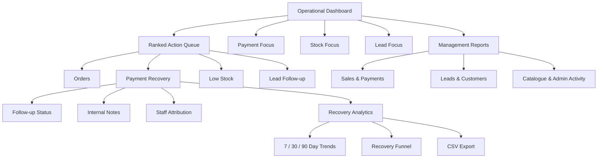

# E-Commerce Admin Dashboard Case Study

### Operations · Payment Recovery · Management Reporting · Catalogue Quality

A public-safe case study showing how a legacy e-commerce administration system was redesigned into a clearer operational control centre without exposing client source code, customer records, or commercial secrets.

> **Confidentiality note:** This repository documents product thinking, architecture, workflows, incidents, and verified test outcomes. It does not contain the commercial application's source code, private repository links, credentials, customer details, or real order data.

---

## Executive Summary

The original admin system contained valuable operational data, but too much of it competed for attention on the same screen. Payment failures, fulfilment queues, stock risks, customer inquiries, catalogue work, and management analytics were all important—yet they did not belong at the same visual priority.

The redesign separated two different jobs:

1. **Operations:** What requires action right now?
2. **Management:** What is happening over time, and why?

The resulting structure introduced:

- a focused operational dashboard
- a ranked live action queue
- dedicated Sales & Payments reporting
- dedicated Leads & Customers reporting
- dedicated Catalogue & Admin Activity reporting
- payment-recovery follow-up tracking
- payment-recovery analytics and CSV export
- clearer stock and catalogue readiness workflows
- mobile-friendly navigation and layouts
- regression coverage protecting calculations, links, and UI contracts

---

## Core Product Principle

> A dashboard should not show everything the system knows. It should show what the user needs to decide next.

The first screen was therefore simplified to answer:

- What requires attention?
- Which queues are urgent?
- Which figures are live current state?
- Which figures are period-based analytics?
- Where should staff click next?

---

## Solution Architecture

---

## Main Workstreams

### 1. Operational Dashboard

The dashboard was reduced from an equal-priority metric wall to:

- four management summary cards
- a ranked action queue
- three compact operational-focus panels
- direct quick actions for Orders, Payment Recovery, Stock, and Leads

Zero-value queues were hidden from the priority area while remaining accessible through detailed reports.

### 2. Management Reporting

Analytics-heavy content moved into dedicated report views:

- **Sales & Payments**
  - accepted revenue
  - accepted orders
  - average order value
  - payment-method performance
  - failures and recovery

- **Leads & Customers**
  - inquiry follow-up
  - WhatsApp interest signals
  - retention indicators
  - top-customer views

- **Catalogue & Admin Activity**
  - catalogue activity
  - product-readiness work
  - shortcuts to detailed staff activity reports

### 3. Payment Recovery

A payment-recovery workflow was introduced for eligible failed and pending-verification statuses.

Capabilities included:

- persistent follow-up status
- internal notes
- last-follow-up time
- staff attribution
- follow-up filters
- failed and pending summaries
- age display and “Over 24h” prioritisation
- recovery funnel metrics
- 7 / 30 / 90-day trends
- staff recovery analytics
- CSV export
- dashboard recovery KPI

### 4. Catalogue Quality and Readiness

Catalogue administration improvements included:

- required item details
- automatic model-number sequencing
- slug synchronisation
- category and display-flow validation
- responsive catalogue index
- shared colour-chart settings
- product-readiness checks
- cached product-review queue

---

## Verified Engineering Evidence

| Work area | Public-safe verification |
|---|---:|
| Payment Recovery follow-up feature | 17 focused tests passed |
| Payment Recovery UI / navigation stage | 236 total tests passed |
| Dashboard Payment Recovery widget | 238 total tests passed |
| Payment Recovery analytics | 242 total tests passed |
| Initial Product Review Queue | 262 total tests passed |
| Cached Product Readiness implementation | 268 total tests passed |
| Dashboard and management report changes | Full CI required and merged after regression validation |

These counts represent automated engineering checks, not business revenue claims.

---

## Important Incidents and Corrections

### Product Review Queue timeout

The first implementation assessed the entire catalogue during an HTTP request. In production, that approach caused timeout risk and was reverted.

The corrected architecture:

- moved expensive assessment into a chunked CLI command
- stored cached audit results
- made the web queue read-only and paginated
- added stale-state handling
- retained search, filters, and sorting
- passed 268 tests

### Truncated stylesheet / JavaScript writes

Two changes were closed or corrected after connector writes truncated shared assets.

The safer replacement approach:

- started again from the clean base branch
- limited changes to smaller isolated files
- avoided replacing large shared assets unnecessarily
- added completeness regression tests
- verified desktop, tablet, and mobile behavior

These incidents are included because reliable engineering is not the absence of mistakes; it is the ability to detect, contain, reverse, and prevent them.

---

## Honest Analytics Language

Tracked WhatsApp clicks or opens were treated as **interest signals**, not automatically as confirmed conversations or conversions.

This wording matters. A dashboard should not overstate what the data proves.

---

## Repository Guide

| Document | Purpose |
|---|---|
| [Product Problem](docs/01-product-problem.md) | Why the original dashboard needed restructuring |
| [Information Architecture](docs/02-information-architecture.md) | Operations vs management reporting |
| [Payment Recovery](docs/03-payment-recovery.md) | Workflow, analytics, and data rules |
| [Catalogue Readiness](docs/04-catalogue-readiness.md) | Product quality and performance-safe audit design |
| [Responsive UI](docs/05-responsive-ui.md) | Desktop, tablet, and mobile design rules |
| [Testing & Safety](docs/06-testing-and-safety.md) | Regression protection and change controls |
| [Incidents & Corrections](docs/07-incidents-and-corrections.md) | Timeout and asset-truncation lessons |
| [Evidence Register](docs/08-evidence-register.md) | Sanitized validation evidence |
| [Diagrams](docs/09-diagrams.md) | Mermaid workflow diagrams |

---

## What This Case Study Demonstrates

- turning operational data into prioritised action
- separating live queues from period analytics
- building payment-recovery workflows instead of passive reports
- improving catalogue quality without slowing page requests
- using regression tests to protect legacy behavior
- designing truthful labels for imperfect tracking data
- handling production incidents with reversions and safer replacements
- improving admin UX without exposing commercial source code

---

## Author

**Ishara Subasinghe**  
E-Commerce Growth Specialist · Laravel Developer · AI Automation

[GitHub Profile](https://github.com/ish30)
