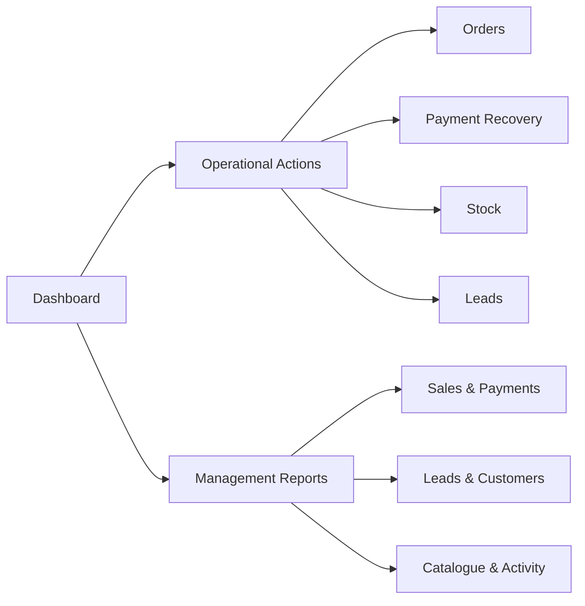

# Information Architecture

## Two-layer model

### Layer 1 — Operational dashboard

Purpose: immediate action.

Contents:

- accepted value and accepted orders
- fulfilment queues
- payment-verification queues
- failed-payment recovery
- stock priorities
- lead follow-up
- ranked actions
- direct operational links

### Layer 2 — Management reports

Purpose: analysis.

Views:

- Sales & Payments
- Leads & Customers
- Catalogue & Admin Activity

## Live state vs selected period

The interface clarified that:

- fulfilment, verification, stock, and active queues are live current state
- revenue, order, payment, lead, and trend metrics may follow the selected period

Without that distinction, users can compare figures that are not measured over the same time frame.

## Navigation model

## Priority logic

The ranked action queue:

- emphasises non-zero queues
- uses severity and count
- avoids making every metric look urgent
- retains links to full reports even when a queue is hidden from the first screen
