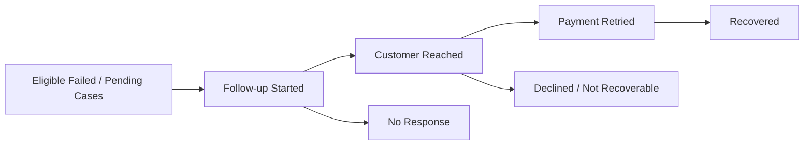

# Payment Recovery

## Why a workflow was needed

A list of failed payments is not a recovery process.

A usable recovery system needs to answer:

- Has anyone followed up?
- What happened?
- When was the last attempt?
- Who handled it?
- Is the payment still recoverable?
- How old is the case?
- What proportion is being recovered?

## Workflow fields

Public-safe workflow design:

- follow-up status
- internal note
- last-follow-up timestamp
- staff attribution
- order/payment status eligibility
- age indicator
- recovery state

## Eligible scope

Follow-up tracking was restricted to defined failed and pending-verification statuses rather than being applied to every order.

## UI improvements

- compact summaries
- responsive two-row filters
- grouped table columns
- horizontal action controls
- modal-based follow-up forms
- human-friendly age
- “Over 24h” badge
- direct queue links

## Analytics

- 7-day trend
- 30-day trend
- 90-day trend
- recovery funnel
- staff recovery views
- CSV export
- dashboard monthly KPI

## Shared source of truth

Dashboard and detailed analytics reused a shared metric service so the same concept was not calculated differently in different screens.

## Simplified funnel

## Data honesty

A recovery rate must be defined from explicit statuses. It should not infer a successful recovery merely because a WhatsApp link was opened.
