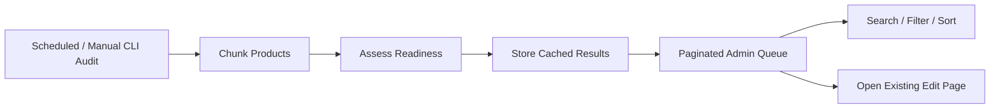

# Catalogue Readiness

## Catalogue administration goals

- complete product information
- consistent model numbers
- valid categories
- correct display flows
- required images
- usable slugs
- clear customisation settings
- efficient review queues

## Item-quality controls

Required fields included:

- category
- item name
- slug
- main image
- technical/dimension image
- short description
- full description
- features
- specifications
- at least one display flow

Visually empty rich-text values such as an empty paragraph were rejected.

## Model and slug behavior

- model numbers used the highest valid sequence rather than the latest database row
- malformed legacy values were ignored safely
- item-name changes updated the slug automatically
- manual slug edits were respected
- clearing the slug resumed automatic synchronisation

## Shared customisation settings

The colour chart and explanatory message were moved to one shared website setting.

Selecting **Customize** became the single product-level control. Redundant colour-setting fields were removed to avoid invalid combinations.

## Product Review Queue incident

### First design

The first queue assessed the complete catalogue during an HTTP request.

Result: production timeout risk and a revert.

### Corrected design

- chunked CLI audit command
- cached audit table
- read-only paginated web queue
- SQL summaries
- filters and sorting
- stale-state handling
- no full-catalogue assessment during page load

## Performance lesson

Expensive catalogue analysis belongs outside the web request when it can be precomputed safely.
