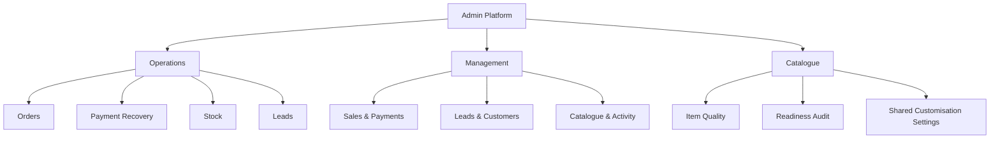
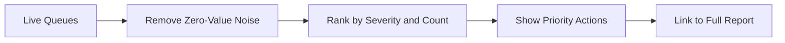
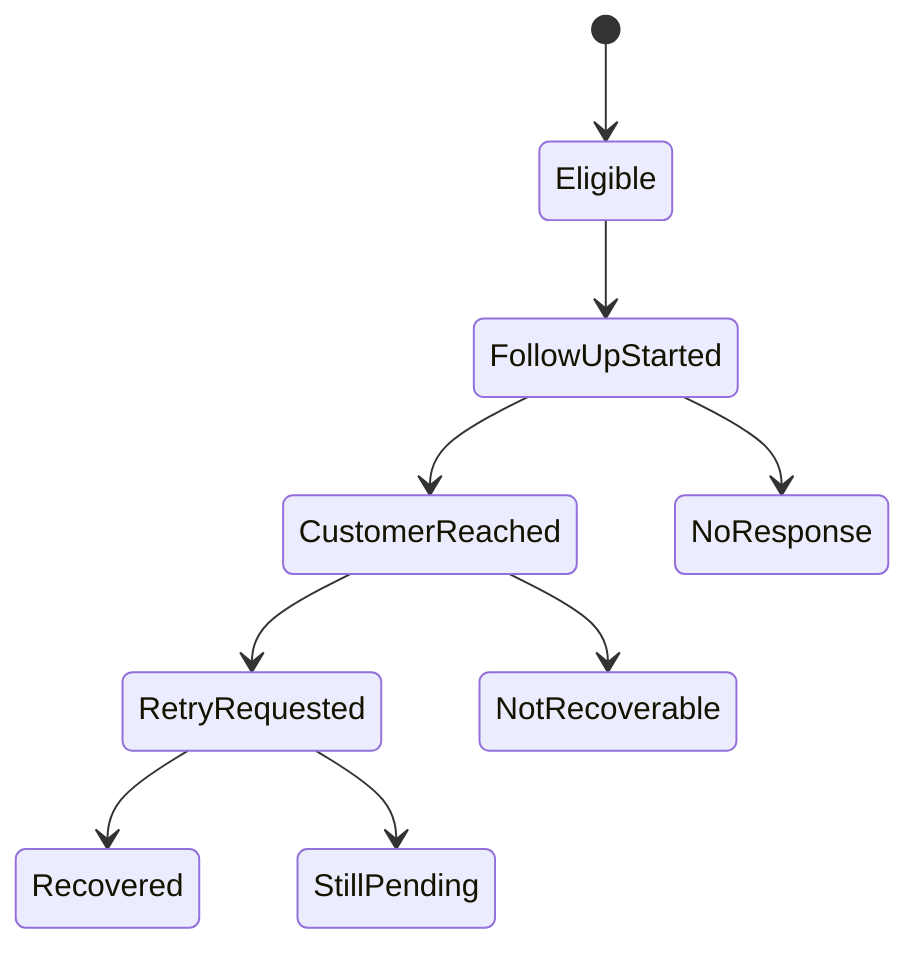

# Diagrams

## Admin information architecture

```mermaid
flowchart TD
    A[Admin Platform] --> B[Operations]
    A --> C[Management]
    A --> D[Catalogue]

    B --> E[Orders]
    B --> F[Payment Recovery]
    B --> G[Stock]
    B --> H[Leads]

    C --> I[Sales & Payments]
    C --> J[Leads & Customers]
    C --> K[Catalogue & Activity]

    D --> L[Item Quality]
    D --> M[Readiness Audit]
    D --> N[Shared Customisation Settings]
```

## Action-priority model

```mermaid
flowchart LR
    A[Live Queues] --> B[Remove Zero-Value Noise]
    B --> C[Rank by Severity and Count]
    C --> D[Show Priority Actions]
    D --> E[Link to Full Report]
```

## Payment recovery lifecycle

```mermaid
stateDiagram-v2
    [*] --> Eligible
    Eligible --> FollowUpStarted
    FollowUpStarted --> CustomerReached
    FollowUpStarted --> NoResponse
    CustomerReached --> RetryRequested
    CustomerReached --> NotRecoverable
    RetryRequested --> Recovered
    RetryRequested --> StillPending
```
